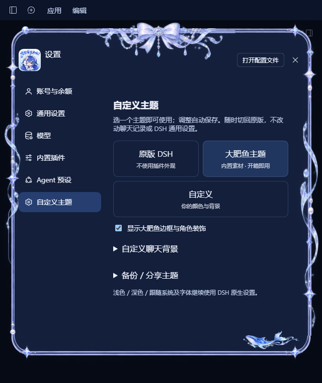

# DSH 自定义主题 · DSH Custom Themes

为**官方 DeepSeek Harness Desktop** 添加主题支持，内置「大肥鱼主题」。不需要旧桌面壳，不修改官方程序，不替换聊天功能。

Custom themes for **official DeepSeek Harness Desktop**, with **Big Fat Fish Theme** built in. No replacement shell, modified official binaries, or replacement chat controls.

[中文](#中文) · [English](#english) · [Changelog](CHANGELOG.md) · [Artwork notice](ASSET_NOTICE.md)



## 中文

### 功能

- **原版 DSH**：一键恢复原生外观，保留已保存的主题参数。
- **大肥鱼主题**：蓝紫色素材、输入框边缘、蝴蝶结与角色装饰，开箱即用；装饰可单独关闭。
- **自定义**：选强调色、浅色背景、深色背景，实时生效并自动保存；可搭配大肥鱼装饰，一键重置配色和装饰。
- **聊天背景**：选择 PNG / JPG / WEBP / GIF（≤ 30 MB），调整铺满／完整显示及不透明度。
- **主题备份／分享**：用一个 JSON 导入、导出配色、装饰和背景。
- 独立 **设置 → 自定义主题** 页面，不混入通用设置。浅色／深色／跟随系统及字号仍由 DSH 管理。

### 安装：无需 Node、NPM 或 NPX

1. 安装官方 DSH Desktop，并至少启动一次。当前已验证 **Windows 0.2.0-rc.2**。
2. 从 Releases 下载 **`dsh-custom-theme-2.0.0-windows.zip`**，完整解压到长期保留的目录，例如 `D:\DSH-Themes\Custom`。不要在 ZIP 内直接运行。
3. 从托盘彻底退出 DSH，双击 **`install.cmd`**。安装器校验包的 SHA256 后调用官方插件安装命令，无需管理员权限。
4. 重开 DSH，在 **设置 → 自定义主题** 点「大肥鱼主题」或「自定义」。首次安装保持原版；升级保留旧选择。

CMD 安装器不依赖 PowerShell 脚本执行权限，不修改执行策略或绕过安全提示。非默认位置可运行 `install.cmd "官方安装目录"`。备用 `install.ps1` 需符合你的系统脚本策略。

若尚无 Release，可按「开发」构建 TGZ 后手动安装；**源码 ZIP 不是一键安装包**。

手动安装（替换 TGZ 的实际路径）：

```powershell
& "$env:LOCALAPPDATA\Programs\DeepSeek Harness\resources\runtime\cli\bin\dsh.cmd" plugin --profile desktop add "D:\DSH-Themes\dsh-theme-whale-girl-2.0.0.tgz"
```

内部包名、配置命名空间及素材文件名保留旧 ID，以继承已保存的设置；这不是旧壳残留，界面的主题名称仍为「大肥鱼主题」。

### 使用

选「自定义」后点颜色块调整配色；文字自动适配背景。展开「自定义聊天背景」选图，图片字节保存在插件配置中，不依赖原文件位置。切回「原版 DSH」隐藏插件颜色、背景和装饰，不删除已保存参数。

「备份／分享主题」导出 JSON，可在另一台装有此插件的 DSH 导入。导入替换当前主题参数；保留旧主题请先导出。导出不含聊天、账号或密钥，但**包含背景图片及文件名**，分享前请检查隐私。

导出优先使用系统另存为。桌面不支持该接口时，会显示 JSON 和复制按钮；将内容保存为 `.json` 即可导入，不依赖可能被 Electron 拦截的网页下载。

### 升级、迁移与卸载

- 保留安装目录。移动 TGZ 或迁移机器后，退出 DSH，在新位置重新运行安装器以修复本地包引用；不要只复制 `node_modules`。
- 内置运行时图片与边框 SVG 内嵌在客户端；16 个原始素材完整随包保存并附 SHA256 清单，不依赖开发者盘符、临时目录或远程素材服务。
- 主题迁移用 JSON；**历史记录迁移另行处理**。完整备份时先退出应用，备份 `%USERPROFILE%\.dsh` 及 `%APPDATA%\@deepseek-ai\dsh-desktop`，其中可能有密钥，勿上传 GitHub。
- 不修改 EXE、`app.asar`、更新器或原生输入／发送逻辑。使用官方主题覆盖、设置插槽与配置接口；装饰适配层遇到未知容器就跳过，不强行重排。
- **不保证所有未来 DSH 版本自动兼容。** 升级后需验证原版切换、深浅色、输入发送、窄窗口、设置边框及滚动。适配范围见 [compatibility.json](compatibility.json)。
- 回退优先选「原版 DSH」。卸载前退出应用，先查当前官方 CLI 的 `plugin --help`；当前版本使用 `plugin --profile desktop remove dsh-theme-whale-girl`。不要删除 sessions、storages 或模型配置。

### 开发

Node.js 24 已验证。构建、测试仅依赖 Node 内置模块；React 与宿主服务由官方 DSH 提供，不安装旧壳。

```powershell
node scripts/build.mjs
node --test tests/*.test.mjs
npm pack
node scripts/release.mjs dsh-theme-whale-girl-2.0.0.tgz
```

最后一条生成 `release/` 安装目录和校验清单；Windows 上还生成安装 ZIP。修改 `src/` 或素材后重建并提交 `lib/`。`assets/` 为原素材，`tests/` 验证生命周期、保存、输入检查及素材一致性。单元测试不能代替真实桌面回归。

仓库不含 DSH 状态、历史、个人背景、凭据或本机日志。公开可见不等于开放授权；未擅自给原素材授予 MIT 等许可证，详见 [ASSET_NOTICE.md](ASSET_NOTICE.md)。

## English

### Features

- **Original DSH** restores native appearance while retaining saved theme settings.
- **Big Fat Fish Theme** includes the existing blue-purple artwork, composer edges, bow and character decorations. Artwork can be disabled independently.
- **Custom** offers an accent, light surface and dark surface with live updates and automatic saving. Optionally include Big Fat Fish artwork, or reset colors and artwork.
- **Chat backgrounds** support PNG / JPG / WEBP / GIF up to 30 MB, Cover / Contain and opacity.
- **Theme backup/sharing** imports and exports colors, artwork and background in one JSON file.
- A separate **Settings → Custom Themes** page keeps plugin options out of General. Native light/dark/system mode and font size remain owned by DSH.

### Easy installation — no Node, NPM or NPX required

1. Install official DSH Desktop and launch it once. **Windows 0.2.0-rc.2** is currently verified.
2. Download **`dsh-custom-theme-2.0.0-windows.zip`** from Releases and extract everything to a permanent folder, e.g. `D:\DSH-Themes\Custom`. Do not run inside the ZIP.
3. Fully exit DSH from the tray and double-click **`install.cmd`**. The installer verifies the TGZ SHA256 and calls the official plugin installer. No administrator rights are required.
4. Reopen DSH, visit **Settings → Custom Themes**, and choose Big Fat Fish or Custom. A fresh install stays Original; an upgrade retains the previous selection.

The CMD installer does not require PowerShell script execution, change execution policy, or bypass security prompts. Non-default installs can use `install.cmd "your official install folder"`. The optional `install.ps1` must comply with your script policy.

If no Release is available yet, build the TGZ using the development steps and install manually. **A source ZIP is not the ready-to-install ZIP.**

Manual installation (replace the TGZ path):

```powershell
& "$env:LOCALAPPDATA\Programs\DeepSeek Harness\resources\runtime\cli\bin\dsh.cmd" plugin --profile desktop add "D:\DSH-Themes\dsh-theme-whale-girl-2.0.0.tgz"
```

Legacy package/configuration IDs and asset filenames intentionally stay stable to inherit existing settings. They do not indicate a bundled legacy shell; the displayed built-in theme is Big Fat Fish.

### Use and sharing

Choose Custom and click color swatches. Text adapts to the surface color. Expand Custom chat background to select an image; its bytes are saved in plugin configuration, independent of the source path. Original DSH hides plugin colors, backgrounds and artwork without deleting selections.

Back up / share a theme exports JSON for another DSH installation with this plugin. Import replaces current theme settings; export first if you want to retain them. Exports never contain chats, accounts or keys, but **do contain the background image and filename**. Check for private information before sharing.

Export prefers the system Save As picker. If unavailable, JSON and a Copy button are shown; save the text as `.json` for import. Export does not depend on web downloads that Electron may block.

### Upgrades, portability and removal

- Keep the install folder. After moving the TGZ or migrating machines, exit DSH and rerun the installer at its new location to repair local package references. Do not copy only `node_modules`.
- Built-in runtime images and frame SVG are embedded in the client. All 16 originals ship with a SHA256 inventory. No developer drive letters, temporary folders or remote artwork services are needed.
- Migrate themes using JSON. **Chat history is separate.** For a full backup, exit DSH and back up `%USERPROFILE%\.dsh` and `%APPDATA%\@deepseek-ai\dsh-desktop`. These may contain secrets; never publish them.
- Official EXE, `app.asar`, updater and native input/send behavior are untouched. Official theme overrides, settings slots and configuration APIs are used. Unknown DOM containers are skipped rather than forcibly rearranged.
- **Future DSH versions are not automatically guaranteed compatible.** Recheck Original, light/dark, sending, narrow windows, settings frames and scrolling after upgrades. Qualification is recorded in [compatibility.json](compatibility.json).
- Choose Original DSH for quick rollback. Exit before removal and consult `plugin --help` in the current official CLI; the qualified version uses `plugin --profile desktop remove dsh-theme-whale-girl`. Do not delete sessions, storages or model configuration.

### Development

Node.js 24 is verified. Build/tests use Node built-ins; official DSH supplies React and host services. No legacy shell is needed.

```powershell
node scripts/build.mjs
node --test tests/*.test.mjs
npm pack
node scripts/release.mjs dsh-theme-whale-girl-2.0.0.tgz
```

The final command creates a `release/` install folder and checksum manifest; Windows also produces an install ZIP. Rebuild and commit `lib/` after source/artwork changes. Tests cover lifecycle, persistence, validation and artwork integrity, not a substitute for live-desktop regression tests.

DSH state, history, personal backgrounds, credentials and machine logs are excluded. Public access is not an open-source license: no MIT or other license is assigned to original artwork without permission. See [ASSET_NOTICE.md](ASSET_NOTICE.md).
